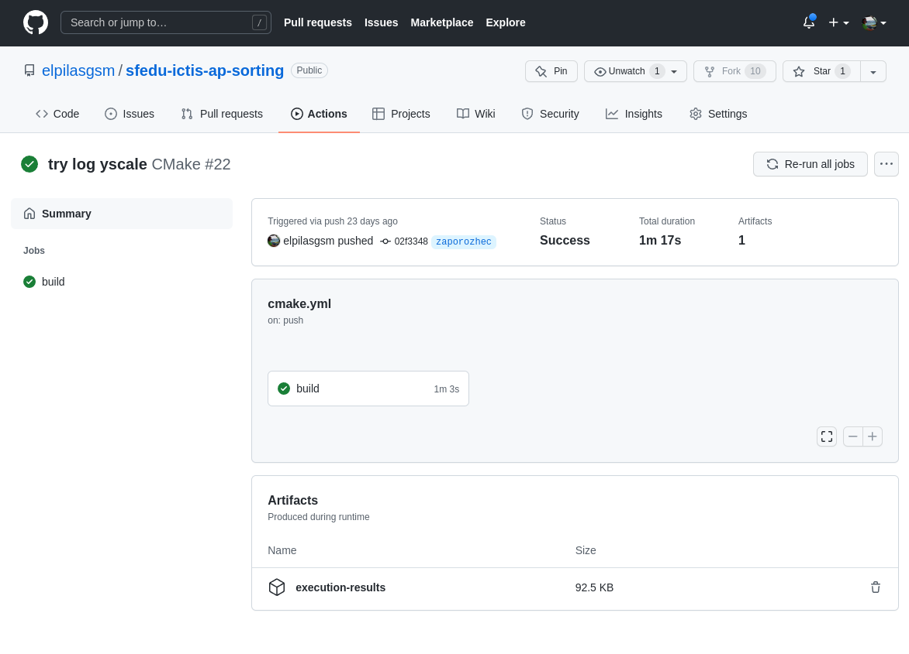

# [ICTIS](http://ictis.sfedu.ru/) [Algorithmization and programming](https://teams.microsoft.com/l/team/19%3aO0HH8J1GghHXuUP-oLiJ3dZeS_cCX32opVsbXOaineI1%40thread.tacv2/conversations?groupId=ed397457-b8a1-48e0-af96-00920a873e6a&tenantId=19ba435d-e46c-436a-84f2-1b01e693e480)


Data Structure algorithms using C++ for course 'Algorithmization and programming'

# Semester II

## Lab #2. Data Structurs.

### Target

To learn the most popular data structures and it's search and CRUD operations. Proof experimentally it's time complexity. Get a comparative graph.

### Instruction

#### 0. Pre-requirements


Students should be familiar with  [Git](https://git-scm.com/) and [GitHub](https://github.com/). Please watch at
least [CS50's video](https://youtu.be/NcoBAfJ6l2Q) if you are not aware about [Git](https://git-scm.com/)
and [GitHub](https://github.com/) at all.

Extra information about Data Structures can be found in [CS50 lecture](https://www.youtube.com/watch?v=2T-A_GFuoTo).

#### 1. Prepare repository.

1. Login to the [GitHub](https://github.com/) with own account. Please [register](https://github.com/signup?ref_cta=Sign+up&ref_loc=header+logged+out&ref_page=%2F&source=header-home)
   Account at github.com using your university account if you don't have such yet. Navigate
   to [this project](https://github.com/elpilasgsm/sfedu-ictis-ap-dsa) and click  in the top right corner. The
   central repository will be cloned to your account. Clone your forked repository to your computer.
   More about Fork you can read [here](https://docs.github.com/en/get-started/quickstart/fork-a-repo).
2. Clone repository to your local computer. Please be sure that you have [Git client](https://git-scm.com/downloads) installed at your computer. Install SSH key at your local machine and provide public key to the GitHub. See more information about Access Keys [here](https://docs.github.com/en/authentication/connecting-to-github-with-ssh/generating-a-new-ssh-key-and-adding-it-to-the-ssh-agent). There are following ways to clone project:

    - In the shell (terminal) run the following command:
    ```shell
    git clone git@github.com:***/sfedu-ictis-ap-dsa.git
    ```
    - Use CLion and [Get from VCS](https://www.jetbrains.com/help/idea/set-up-a-git-repository.html).
    - Use [Git For Windows](https://gitforwindows.org/)

#### 2. Coding

In your forked project you must create the following files and implement methods from the namespaces from the corresponding H files
The following table decribes the H files and required cpp files created with implementation.

| #   | H file (exists) | CPP file (must be created by student) | Namespace with function prototypes | 
|-----|-----------------|---------------------------------------|------------------------------------| 
| 1   | Array.h         | Array.cpp | ArrayNS |
| 2   | Stack.h         | Stack.cpp | StackNS |
| 3   | List.h          | List.cpp | ListNS |
| 4   | Queue.h         | Queue.cpp | QueueNS |

Student also should follow the TODO description near each function prototypes.

#### 3. Validate code

Push your code to the remote repository (origin). The following approaches can be used:

- In the shell (terminal) run the following command:

```shell
    git commit -am "My code"
    git enqueue 
```
- In CLion  click 'Ctrl' + 'K', fill the commit description, choose changed files and click 'Commit' button.
  After click 'Ctrl' + 'Shift' + 'K' and click 'Push' button.

Your code will be uploaded to the remote server where automatic tests will be run.
You can find the results of the performed tests at the  page. If the latest workflow in 'green'
than your code passed all tests and lab is done properly, otherwise you should change the code.

#### 4. Collect Results

Click at the latest 'green' workflow at the 'Actions' page. Scroll down to the 'Artifacts' group. In the 'Artifacts' group
you will find 'execution-results' package (clickable).

Click it to retrieve the results. The zip file contains 3 csv files with
execution time and the png file with the graph that you should include to the Lab report. 